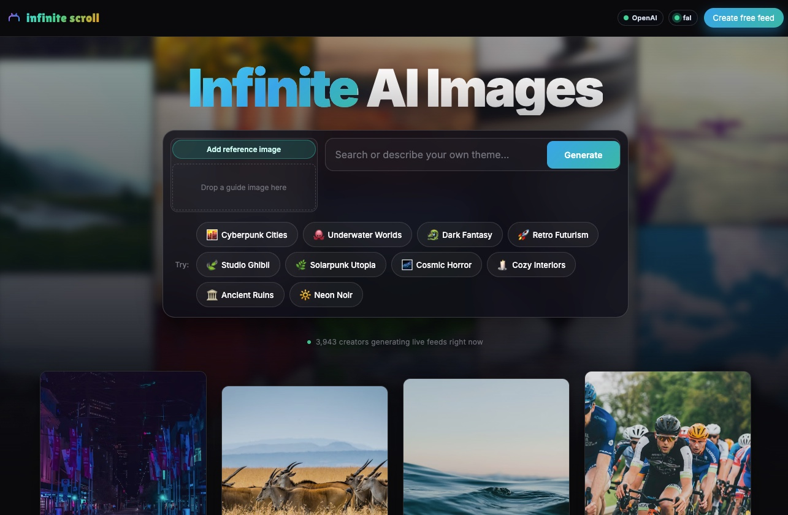

# Infinite Scroll



An endless AI image feed. Upload a reference image, describe a direction, and scroll through AI-generated variations — powered by **OpenAI WebSocket** + **fal.ai Flux 2 Klein Realtime WebSocket**.

## How It Works

1. Upload a **reference image** + type a creative direction
2. **OpenAI** (via WebSocket) expands your direction into transformation prompts using structured JSON output
3. **Flux 2 Klein** (via fal.ai Realtime WebSocket) applies each prompt as an img2img transformation
4. Scroll down — more variations stream in as you go

## Architecture

```
Browser (React)  ←WebSocket→  Backend (Express)  ←WebSocket→  OpenAI Responses API (prompt expansion)
                                                  ←WebSocket→  fal.ai Flux 2 Klein Realtime (img2img)
```

- **3 WebSocket connections** — zero HTTP in the core flow
- **Structured JSON output** from OpenAI (no tool calls) for minimal latency
- **3 concurrent** image generations via priority queue
- **Immediate first images** fire to fal before OpenAI responds for fast perceived speed
- **Generation tracking** — reset/home cleanly cancels in-flight jobs

## Tech Stack

| Layer | Tech |
|-------|------|
| Frontend | React, Vite, TypeScript |
| Backend | Express, ws, TypeScript |
| AI (prompts) | OpenAI Responses WebSocket (gpt-4.1-nano) |
| AI (images) | fal.ai Flux 2 Klein Realtime WebSocket |
| Shared | Zod schemas |

## Setup

```bash
npm install
cp backend/.env.example backend/.env
# Add your keys: OPENAI_API_KEY, FAL_KEY
npm run dev
```

Frontend: http://localhost:5173 — Backend: http://localhost:8787

## Customizing the System Prompt

Edit `backend/src/config/system-prompt.txt` to change how OpenAI generates transformation prompts. Restart the backend after editing.
